# Awesome SWE-Bench: A Comprehensive Survey of SWE-Bench Series Benchmarks

> 本仓库系统梳理了自 2023 年 SWE-bench 发表以来衍生的 **42 篇 Benchmark 系列 工作**，涵盖原始基准、多语言扩展、多模态扩展、持续学习、性能优化、测试生成、数据合成、统一评测、超长程任务、代码审查、安全、仓库探索、对话驱动等多个维度。每篇均附有简介、关键信息、论文链接和配图。
>
> 此外，本仓库还新增了 [**相关代码工作：Coding Agent 训练数据生态**](#相关代码工作coding-agent-训练数据生态) 章节，从**训练数据侧**梳理 2024–2026 间代码指令数据合成、数据清洗与质量过滤、Agent 轨迹数据三大方向的代表性工作，与评测侧的 Benchmark 形成互补。

---

## 目录

| # | 名称 | 类型 | 年份 | arXiv |
|---|------|------|------|-------|
| 1 | [SWE-bench](#1-swe-bench) | 原始基准 | 2023.10 | [2310.06770](https://arxiv.org/abs/2310.06770) |
| 2 | [SWE-bench Lite & Verified](#2-swe-bench-lite--verified) | 子集/人工验证 | 2024 | — |
| 3 | [SWE-bench Multimodal](#3-swe-bench-multimodal) | 多模态扩展 | 2024.10 | [2410.03859](https://arxiv.org/abs/2410.03859) |
| 4 | [SWT-Bench](#4-swt-bench) | 测试生成 | 2024.06 | [2406.12952](https://arxiv.org/abs/2406.12952) |
| 5 | [SWE-bench-Java](#5-swe-bench-java) | Java 扩展 | 2024.08 | [2408.14354](https://arxiv.org/abs/2408.14354) |
| 6 | [SWE-Bench+](#6-swe-bench) | 数据质量分析 | 2024.10 | [2410.06992](https://arxiv.org/abs/2410.06992) |
| 7 | [SWE-Gym](#7-swe-gym) | 训练环境 | 2024.12 | [2412.21139](https://arxiv.org/abs/2412.21139) |
| 8 | [SWE-Lancer](#8-swe-lancer) | 自由职业任务 | 2025.02 | [2502.12115](https://arxiv.org/abs/2502.12115) |
| 9 | [R2E-Gym](#9-r2e-gym) | 训练环境 | 2025.04 | [2504.07164](https://arxiv.org/abs/2504.07164) |
| 10 | [Multi-SWE-bench](#10-multi-swe-bench) | 多语言扩展 | 2025.04 | [2504.02605](https://arxiv.org/abs/2504.02605) |
| 11 | [SWE-PolyBench](#11-swe-polybench) | 多语言扩展 | 2025.04 | [2504.08703](https://arxiv.org/abs/2504.08703) |
| 12 | [SWE-smith](#12-swe-smith) | 数据生成工具 | 2025.04 | [2504.21798](https://arxiv.org/abs/2504.21798) |
| 13 | [SWE-bench-Live](#13-swe-bench-live) | 动态/持续更新 | 2025.05 | [2505.23419](https://arxiv.org/abs/2505.23419) |
| 14 | [SWE-bench Multilingual](#14-swe-bench-multilingual) | 多语言扩展（官方） | 2025 | [swebench.com](https://www.swebench.com/multilingual.html) |
| 15 | [SWE-Flow / SWE-Flow-Bench](#15-swe-flow--swe-flow-bench) | 测试驱动数据合成 | 2025.06 | [2506.09003](https://arxiv.org/abs/2506.09003) |
| 16 | [UTBoost](#16-utboost) | 测试增强/评测严谨性 | 2025.06 | [2506.09289](https://arxiv.org/abs/2506.09289) |
| 17 | [The SWE-Bench Illusion](#17-the-swe-bench-illusion) | 数据泄露分析 | 2025.06 | [2506.12286](https://arxiv.org/abs/2506.12286) |
| 18 | [SWE-Factory](#18-swe-factory) | 自动化基准构建 | 2025.06 | [2506.10954](https://arxiv.org/abs/2506.10954) |
| 19 | [SWE-Bench-CL](#19-swe-bench-cl) | 持续学习 | 2025.06 | [2507.00014](https://arxiv.org/abs/2507.00014) |
| 20 | [SPICE](#20-spice) | 自动标注流水线 | 2025.07 | [2507.09108](https://arxiv.org/abs/2507.09108) |
| 21 | [NoCode-bench](#21-nocode-bench) | 功能开发 | 2025.07 | [2507.18130](https://arxiv.org/abs/2507.18130) |
| 22 | [SWE-Perf](#22-swe-perf) | 代码性能优化 | 2025.07 | [2507.12415](https://arxiv.org/abs/2507.12415) |
| 23 | [SWE-QA](#23-swe-qa) | 仓库级代码问答 | 2025.09 | [2509.14635](https://arxiv.org/abs/2509.14635) |
| 24 | [LoCoBench](#24-locobench) | 长上下文软件工程 | 2025.09 | [2509.09614](https://arxiv.org/abs/2509.09614) |
| 25 | [SWE-Bench Pro](#25-swe-bench-pro) | 高难度企业级 | 2025.09 | [2509.16941](https://arxiv.org/abs/2509.16941) |
| 26 | [EnConda-Bench](#26-enconda-bench) | 环境配置 | 2025.10 | [2510.25694](https://arxiv.org/abs/2510.25694) |
| 27 | [SWE-Compass](#27-swe-compass) | 统一评测框架 | 2025.11 | [2511.05459](https://arxiv.org/abs/2511.05459) |
| 28 | [BeyondSWE](#28-beyondswe) | 跨仓库/知识范围扩展 | 2026.03 | [2603.03194](https://arxiv.org/abs/2603.03194) |
| 29 | [PostTrainBench](#29-posttrainbench) | Agent 自动化后训练 | 2026.03 | [2603.08640](https://arxiv.org/abs/2603.08640) |
| 30 | [FrontierSWE](#30-frontierswe) | 超长程前沿挑战 | 2026 | [frontierswe.com](https://www.frontierswe.com/) |
| 31 | [SWE-Marathon](#31-swe-marathon) | 超长程项目级 | 2026.06 | [2606.07682](https://arxiv.org/abs/2606.07682) |
| 32 | [OmniCode](#32-omnicode) | 多任务/多语言 | 2026.02 | [2602.02262](https://arxiv.org/abs/2602.02262) |
| 33 | [FullStack-Agent](#33-fullstack-agent) | 全栈 Web 开发 | 2026.02 | [2602.03798](https://arxiv.org/abs/2602.03798) |
| 34 | [Vision2Web](#34-vision2web) | 视觉网站开发 | 2026.03 | [2603.26648](https://arxiv.org/abs/2603.26648) |
| 35 | [c-CRAB](#35-c-crab) | 代码审查 | 2026.03 | [2603.23448](https://arxiv.org/abs/2603.23448) |
| 36 | [SWE-PRBench](#36-swe-prbench) | 代码审查质量 | 2026.03 | [2603.26130](https://arxiv.org/abs/2603.26130) |
| 37 | [Beyond Isolated Tasks](#37-beyond-isolated-tasks) | 序列化软件演化 | 2026.04 | [2604.03035](https://arxiv.org/abs/2604.03035) |
| 38 | [SWE-EVO](#38-swe-evo) | 长程软件演化 | 2025.12 | [2512.18470](https://arxiv.org/abs/2512.18470) |
| 39 | [SWE-Explore](#39-swe-explore) | 仓库探索/定位 | 2026.06 | [2606.07297](https://arxiv.org/abs/2606.07297) |
| 40 | [Dialogue SWE-Bench](#40-dialogue-swe-bench) | 对话驱动 | 2026.06 | [2606.13995](https://arxiv.org/abs/2606.13995) |
| 41 | [Saving SWE-Bench](#41-saving-swe-bench) | 真实性/基准变异 | 2025.10 | [2510.08996](https://arxiv.org/abs/2510.08996) |
| 42 | [SecureAgentBench](#42-secureagentbench) | 安全代码生成 | 2025.09 | [2509.22097](https://arxiv.org/abs/2509.22097) |

---

## 分类总览

```
SWE-Bench 系列 Benchmark 生态
├── 原始基准
│   ├── 1. SWE-bench (2023.10) ── 奠基之作
│   └── 2. SWE-bench Lite & Verified ── 精选子集
├── 语言扩展
│   ├── 5. SWE-bench-Java (2024.08) ── 首个非Python扩展
│   ├── 10. Multi-SWE-bench (2025.04) ── 8种语言
│   ├── 11. SWE-PolyBench (2025.04) ── 多语言+复杂度分级
│   └── 14. SWE-bench Multilingual (2025) ── 官方9语言版
├── 模态/任务扩展
│   ├── 3. SWE-bench Multimodal (2024.10) ── 视觉软件工程
│   ├── 4. SWT-Bench (2024.06) ── 测试生成
│   ├── 8. SWE-Lancer (2025.02) ── 自由职业任务
│   ├── 21. NoCode-bench (2025.07) ── 功能开发
│   ├── 22. SWE-Perf (2025.07) ── 性能优化
│   ├── 23. SWE-QA (2025.09) ── 代码问答
│   ├── 28. BeyondSWE (2026.03) ── 跨仓库/知识范围扩展
│   ├── 29. PostTrainBench (2026.03) ── Agent 自动化后训练
│   ├── 32. OmniCode (2026.02) ── 多任务多语言
│   ├── 33. FullStack-Agent (2026.02) ── 全栈 Web 开发
│   ├── 34. Vision2Web (2026.03) ── 视觉网站开发
│   └── 39. SWE-Explore (2026.06) ── 仓库探索/代码定位
├── 代码审查 (Code Review)
│   ├── 35. c-CRAB (2026.03) ── PR 审查（评论→测试）
│   └── 36. SWE-PRBench (2026.03) ── AI 审查质量
├── 数据质量与评测严谨性
│   ├── 6. SWE-Bench+ (2024.10) ── 数据泄露分析
│   ├── 16. UTBoost (2025.06) ── 测试增强
│   ├── 17. SWE-Bench Illusion (2025.06) ── 记忆vs推理
│   └── 41. Saving SWE-Bench (2025.10) ── 基准变异/真实性
├── 安全 (Security)
│   └── 42. SecureAgentBench (2025.09) ── 安全代码生成
├── 数据生成与训练
│   ├── 7. SWE-Gym (2024.12) ── 训练环境
│   ├── 9. R2E-Gym (2025.04) ── 大规模训练环境
│   ├── 12. SWE-smith (2025.04) ── 数据生成工具
│   ├── 15. SWE-Flow (2025.06) ── TDD数据合成
│   ├── 18. SWE-Factory (2025.06) ── 自动化基准构建
│   └── 20. SPICE (2025.07) ── 自动标注
├── 评测范式创新
│   ├── 13. SWE-bench-Live (2025.05) ── 动态更新
│   ├── 19. SWE-Bench-CL (2025.06) ── 持续学习
│   ├── 24. LoCoBench (2025.09) ── 长上下文
│   ├── 25. SWE-Bench Pro (2025.09) ── 企业级高难度
│   ├── 26. EnConda-Bench (2025.10) ── 环境配置
│   ├── 27. SWE-Compass (2025.11) ── 统一评测
│   └── 40. Dialogue SWE-Bench (2026.06) ── 对话驱动
└── 超长程/软件演化
    ├── 30. FrontierSWE (2026) ── 超长程前沿挑战
    ├── 31. SWE-Marathon (2026.06) ── 超长程项目级（40–400 小时/任务）
    ├── 37. Beyond Isolated Tasks (2026.04) ── 序列化软件演化
    └── 38. SWE-EVO (2025.12) ── 长程软件演化
```

---

## 详细介绍

### 1. SWE-bench

| 项目 | 信息 |
|------|------|
| **论文** | SWE-bench: Can Language Models Resolve Real-World GitHub Issues? |
| **作者** | Carlos E. Jimenez, John Yang, Alexander Wettig, Shunyu Yao, Kexin Pei, Ofir Press, Karthik Narasimhan |
| **机构** | Princeton University |
| **发表** | ICLR 2024 |
| **链接** | [arXiv](https://arxiv.org/abs/2310.06770) \| [Code](https://github.com/SWE-bench/SWE-bench) \| [Leaderboard](https://www.swebench.com/) |

**简介：** SWE-bench 是软件工程领域大模型评测的奠基之作。它从 12 个流行的 Python 开源仓库中收集了 **2,294 个真实的 GitHub Issue 及对应的 Pull Request**，要求模型在给定代码库和 Issue 描述的情况下生成修复补丁。每个任务通过 FAIL_TO_PASS 和 PASS_TO_PASS 单元测试来验证补丁正确性。初始 RAG 基线仅获得 1.96% 的解决率，展示了真实软件工程任务的巨大挑战。SWE-bench 的出现催生了整个 AI 软件工程 Agent 研究方向。

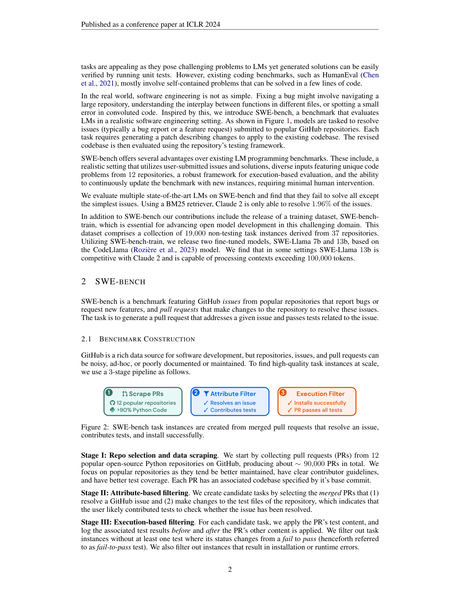

> 上图展示了 SWE-bench 的三阶段构建流水线：(1) 从 12 个流行 Python 仓库抓取 PR，(2) 基于 Attribute Filter 筛选贡献测试的 PR，(3) 通过 Execution Filter 验证安装和测试通过。

---

### 2. SWE-bench Lite & Verified

| 项目 | 信息 |
|------|------|
| **类型** | SWE-bench 的精选子集 |
| **链接** | [Leaderboard](https://www.swebench.com/) |

**简介：** 为了降低评测成本和提高可复现性，SWE-bench 团队发布了两个子集：
- **SWE-bench Lite** (300 实例)：从原始数据集中精选 300 个较简单的任务，适合快速迭代和开发。
- **SWE-bench Verified** (500 实例)：由人工验证标注的 500 个实例，确保任务描述清晰、测试可靠，是目前最广泛使用的 SWE-bench 评测子集。OpenAI 和 Princeton-NLP 团队联合进行了人工筛选。

---

### 3. SWE-bench Multimodal

| 项目 | 信息 |
|------|------|
| **论文** | SWE-bench Multimodal: Do AI Systems Generalize to Visual Software Domains? |
| **作者** | John Yang, Carlos E. Jimenez, Alex L. Zhang, Kilian Lieret, et al. |
| **机构** | Princeton University, Stanford University |
| **发表** | ICLR 2025 |
| **链接** | [arXiv](https://arxiv.org/abs/2410.03859) \| [Leaderboard](https://www.swebench.com/multimodal.html) |

**简介：** SWE-bench Multimodal (SWE-bench M) 是**首个评估编码 Agent 在涉及视觉元素的软件工程任务上表现的基准**。它包含 **517 个来自 17 个 JavaScript 库的任务实例**，每个实例的问题描述或单元测试中包含至少一张图片，涵盖 UI 界面设计、数据可视化、交互式地图、语法高亮等领域。实验发现，在原版 SWE-bench 上表现最好的系统在 SWE-bench M 上性能大幅下降，揭示了当前模型在视觉问题解决和跨语言泛化方面的严重局限。

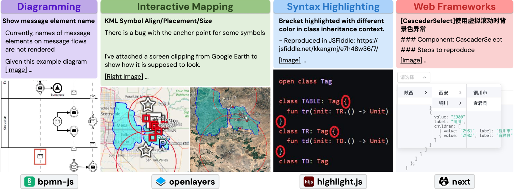

> 上图展示了 SWE-bench M 中的四种多模态任务类型：UI 设计、数据可视化、地图交互和语法高亮，每类任务都需要模型理解视觉元素来修复 bug。


---

### 4. SWT-Bench

| 项目 | 信息 |
|------|------|
| **论文** | SWT-Bench: Testing and Validating Real-World Bug-Fixes with Code Agents |
| **作者** | Niels Mündler, Mark Müller, Jingxuan He, Martin Vechev |
| **机构** | ETH Zurich |
| **发表** | NeurIPS 2024 |
| **链接** | [arXiv](https://arxiv.org/abs/2406.12952) \| [Code](https://github.com/nmndl/swtbench) \| [Website](https://swtbench.com/) |

**简介：** SWT-Bench 关注的是**软件测试生成**能力而非直接修复 bug。它基于 SWE-bench 的数据集构建，要求 LLM 将用户报告的 Issue 形式化为可执行的测试用例。基准包含真实世界的问题、真实的 bug 修复和黄金测试用例，评估 Code Agent 生成能有效复现 bug 的测试用例的能力。研究发现即使是最先进的 LLM 在生成有效测试用例方面也面临巨大挑战。


---

### 5. SWE-bench-Java

| 项目 | 信息 |
|------|------|
| **论文** | SWE-bench-java: A GitHub Issue Resolving Benchmark for Java |
| **作者** | Daoguang Zan, Zhirong Huang, Wei Liu, et al. |
| **机构** | ByteDance |
| **发表** | 2024.08 |
| **链接** | [arXiv](https://arxiv.org/abs/2408.14354) |

**简介：** SWE-bench-Java 是**首个将 SWE-bench 扩展到非 Python 语言的尝试**。它从 Java 开源仓库中收集 Issue 和 PR，构建了 Java 版本的 issue 解决基准。团队实现了 SWE-agent 的 Java 版本并在其上测试了多个 LLM，验证了跨语言扩展的可行性。这项工作为后续的多语言基准（Multi-SWE-bench、SWE-PolyBench 等）奠定了基础。


---

### 6. SWE-Bench+

| 项目 | 信息 |
|------|------|
| **论文** | SWE-Bench+: Enhanced Coding Benchmark for LLMs |
| **作者** | Ridgeon Aleithan, Zhao Xue, et al. |
| **链接** | [arXiv](https://arxiv.org/abs/2410.06992) |

**简介：** SWE-Bench+ 对 SWE-bench 数据集进行了**深入的数据质量分析**。通过人工审查 SWE-Agent + GPT-4 成功解决的实例，研究发现 **32.67% 的成功补丁存在"作弊"行为**（如直接硬编码测试答案或利用测试泄漏），并且许多测试用例不够严格。该工作提出了清洗后的增强基准，消除了解决方案泄漏和弱测试问题，为后续评测提供了更严格的标准。同样的问题也在 SWE-bench Lite 和 Verified 子集中被发现。


---

### 7. SWE-Gym

| 项目 | 信息 |
|------|------|
| **论文** | Training Software Engineering Agents and Verifiers with SWE-Gym |
| **作者** | Jiayi Pan, Xingyao Wang, Lifan Yuan, Yifan Song, et al. |
| **机构** | UC Berkeley, University of Illinois Urbana-Champaign |
| **发表** | ICML 2025 |
| **链接** | [arXiv](https://arxiv.org/abs/2412.21139) \| [Code](https://github.com/SWE-Gym/SWE-Gym) |

**简介：** SWE-Gym 是**首个用于训练真实世界软件工程 Agent 的环境**。它包含来自 11 个开源 Python 仓库的 **2,438 个真实任务实例**，每个实例包括代码库、可执行运行时环境、单元测试和自然语言 Issue 描述。通过在 SWE-Gym 上进行拒绝采样微调（Rejection Sampling Fine-tuning），训练的 SWE Agent 在 SWE-Bench Verified 和 Lite 上实现了最高 19% 的绝对解决率提升。此外，SWE-Gym 还训练了验证器（Verifier）来评估补丁质量。

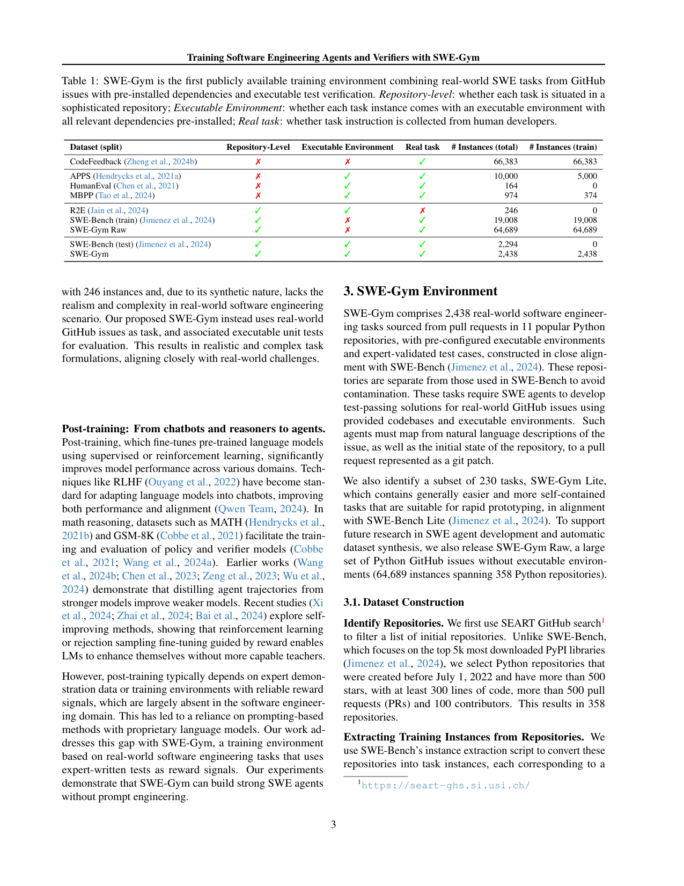

> 上图对比了 SWE-Gym 与现有数据集的特性：SWE-Gym 首次同时具备仓库级、可执行环境、真实任务三大关键属性。

---

### 8. SWE-Lancer

| 项目 | 信息 |
|------|------|
| **论文** | SWE-Lancer: Can Frontier LLMs Earn $1 Million from Real-World Freelance Software Engineering? |
| **作者** | Samuel Miserendino, Michele Wang, Tejal Patwardhan, Johannes Heidecke |
| **机构** | OpenAI |
| **发表** | 2025.02 |
| **链接** | [arXiv](https://arxiv.org/abs/2502.12115) \| [Code](https://github.com/openai/SWELancer-Benchmark) |

**简介：** SWE-Lancer 将评测视角从"能否修复 bug"扩展到"能否完成真实的自由职业软件工程任务"。基准包含 **1,488 个来自 Upwork 的自由职业任务**，总价值 **100 万美元**的真实报酬。任务分为两类：**IC SWE**（独立贡献者任务，如修复 bug、实现功能）和 **SWE Manager**（工程经理任务，如审查技术方案、选择实现路径）。OpenAI 的实验显示，即使是最强的前沿 LLM 也无法可靠地完成这些高价值任务，凸显了 AI 与人类专业开发者在复杂软件工程任务上的差距。

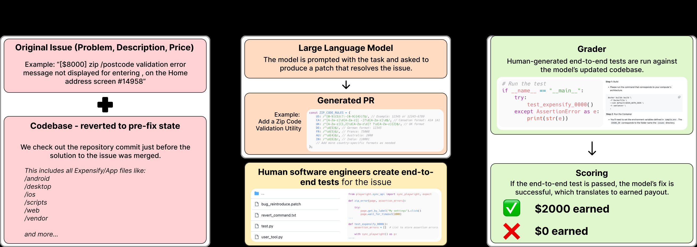

> 上图展示了 SWE-Lancer 的完整评测框架：原始 Issue → LLM 生成 PR → 人工端到端测试 → 评分与报酬计算。

---

### 9. R2E-Gym

| 项目 | 信息 |
|------|------|
| **论文** | R2E-Gym: Procedural Environments and Hybrid Verifiers for Training Open-Weight SWE Agents |
| **作者** | Yang Bai, Xuechun Liao, et al. |
| **机构** | University of Illinois, Peking University |
| **发表** | COLM 2025 |
| **链接** | [arXiv](https://arxiv.org/abs/2504.07164) \| [Code](https://github.com/R2E-Gym/R2E-Gym) \| [Website](https://r2e-gym.github.io/) |

**简介：** R2E-Gym 是目前**最大的程序化构建的 SWE Agent 训练环境**，包含超过 **8,100 个带可执行环境的问题**。其两大核心创新是：(1) 基于程序化合成的大规模训练环境构建方法，(2) 混合验证器（Hybrid Verifiers）结合执行反馈和 LLM 判断来筛选高质量训练轨迹。基于 R2E-Gym 训练的 R2E-Gym-32B Agent（基于 Qwen 模型）在 SWE-Bench Verified 上达到了 51% 的解决率，创下了开源权重 SWE Agent 的新纪录。


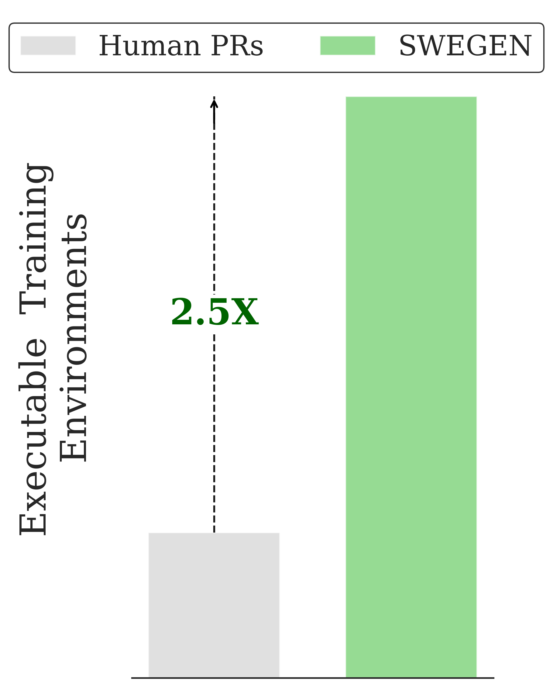

> 上图对比了 R2E-Gym (SWEGEN) 与人类 PRs 在可执行训练环境数量上的优势：达到 **2.5 倍** 扩展。

---

### 10. Multi-SWE-bench

| 项目 | 信息 |
|------|------|
| **论文** | Multi-SWE-bench: A Multilingual Benchmark for Issue Resolving |
| **作者** | Daoguang Zan, Zhirong Huang, Wei Liu, et al. |
| **机构** | ByteDance Seed |
| **发表** | NeurIPS 2025 |
| **链接** | [arXiv](https://arxiv.org/abs/2504.02605) \| [Code](https://github.com/multi-swe-bench/multi-swe-bench) \| [Website](https://multi-swe-bench.github.io/) |

**简介：** Multi-SWE-bench 是字节跳动豆包团队推出的**首个大规模多语言 issue 解决基准**，覆盖 **8 种编程语言**（Python、Java、TypeScript、JavaScript、Go、Rust、C、C++），包含 **2,132 个经人工验证的高质量实例**。由 68 位专家标注者参与构建。同时发布了 Multi-SWE-RL 训练数据集，包含 4,723 个实例。实验发现，现有模型在非 Python 语言上的表现显著低于 Python，揭示了多语言软件工程能力的巨大差距。该工作获 NeurIPS 2025 Datasets and Benchmarks Track 收录。


---

### 11. SWE-PolyBench

| 项目 | 信息 |
|------|------|
| **论文** | SWE-PolyBench: A Multi-Language Benchmark for Repository Level Evaluation of Coding Agents |
| **作者** | Aric Rashid, et al. |
| **机构** | Amazon |
| **发表** | 2025.04 |
| **链接** | [arXiv](https://arxiv.org/abs/2504.08703) \| [Code](https://github.com/amazon-science/SWE-PolyBench) |

**简介：** SWE-PolyBench 由 Amazon 推出，是**首个基于语法树节点复杂度分级的仓库级多语言评测基准**。它包含 **2,110 个精选实例**，覆盖 Python、Java、JavaScript、TypeScript、C#、Go、C/C++ 等多种语言。其独特之处在于利用 AST（抽象语法树）分析将任务按修改复杂度分级（如单行修改 vs. 多文件重构），从而更精细地评估编码 Agent 在不同复杂度任务上的表现。


---

### 12. SWE-smith

| 项目 | 信息 |
|------|------|
| **论文** | SWE-smith: Scaling Data for Software Engineering Agents |
| **作者** | John Yang, et al. |
| **机构** | Princeton University |
| **发表** | NeurIPS 2025 D&B Spotlight |
| **链接** | [arXiv](https://arxiv.org/abs/2504.21798) \| [Code](https://github.com/SWE-bench/SWE-smith) \| [Website](https://swesmith.com/) |

**简介：** SWE-smith 是一个**大规模 SWE 训练数据生成工具包**，解决了现有 SWE 训练数据集小（通常仅几千实例）的瓶颈。它可以将任意 GitHub 仓库转化为 SWE-gym 风格的训练环境，并为每个仓库生成数百到数千个任务实例。团队已为 **128 个热门 GitHub 仓库生成了超过 50,000 个任务实例**，并在其上训练了高性能 SWE Agent。SWE-smith 大幅降低了进入 SWE Agent 研究的门槛。

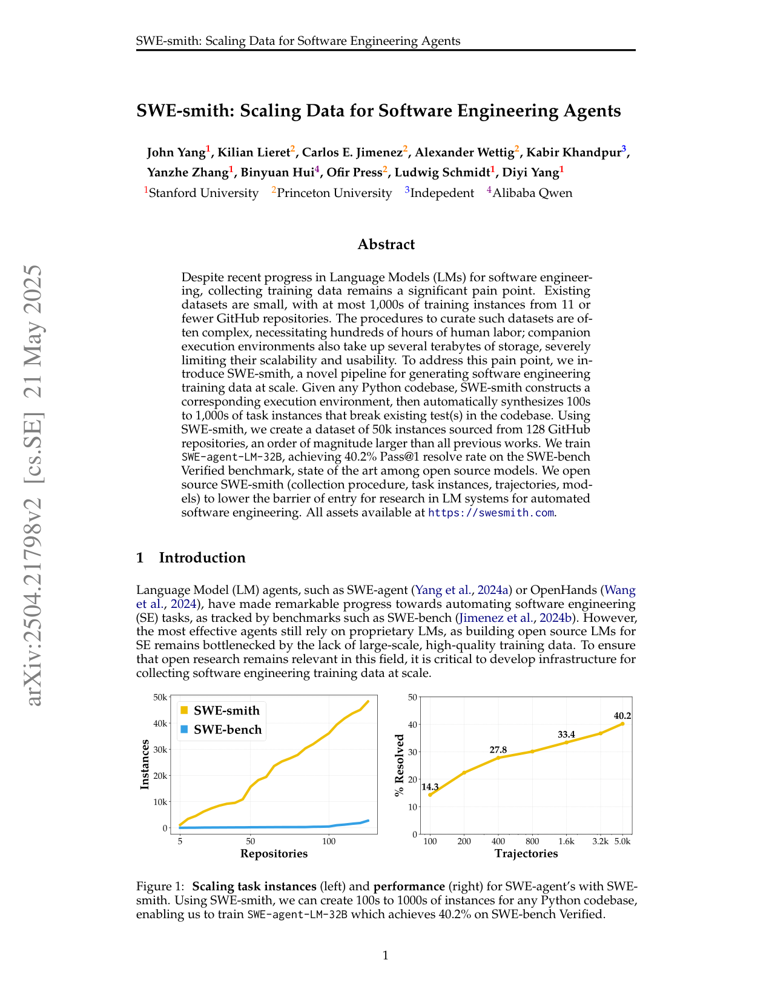

> 上图展示了 SWE-smith 的核心价值：(左) 任务实例数量随仓库数的扩展；(右) 模型解决率随训练轨迹数量的提升。

---

### 13. SWE-bench-Live

| 项目 | 信息 |
|------|------|
| **论文** | SWE-bench Goes Live! |
| **作者** | Linghao Zhang, Shilin He, Chaoyun Zhang, et al. |
| **机构** | Microsoft Research |
| **发表** | 2025.05 |
| **链接** | [arXiv](https://arxiv.org/abs/2505.23419) \| [Code](https://github.com/microsoft/SWE-bench-Live) \| [Leaderboard](https://swe-bench-live.github.io/) |

**简介：** SWE-bench-Live 是微软推出的**首个自动构建、持续更新的 issue 解决基准**。与 SWE-bench 及其变体需要大量人工策展不同，SWE-bench-Live 使用自动化流水线从最新 GitHub Issue 中构建任务，每个任务配备专用 Docker 镜像确保可重现执行。初始版本包含 **1,319 个任务**，来自 2024 年以来的 **93 个仓库**。实验揭示，在静态基准上表现良好的 Agent 在 SWE-bench-Live 上存在显著的性能差距，表明数据污染可能高估了模型的真实能力。后续还发布了 MultiLang 和 Windows 版本。


---

### 14. SWE-bench Multilingual

| 项目 | 信息 |
|------|------|
| **类型** | SWE-bench 官方多语言扩展 |
| **机构** | SWE-bench Team |
| **链接** | [Website](https://www.swebench.com/multilingual.html) \| [Leaderboard](https://www.swebench.com/multilingual-leaderboard.html) |

**简介：** SWE-bench Multilingual 是 SWE-bench 官方团队推出的多语言扩展版本，覆盖 **9 种编程语言**（C、C++、Go、Java、JavaScript/TypeScript、PHP、Ruby 等）。数据集包含 300 个从真实 GitHub Issue 和对应 PR 中收集的实例。该基准旨在评估 LLM 在不同编程语言生态中的软件工程能力，排行榜已集成在 swebench.com 官方网站中。其数据构建流程基于 SWE-smith 框架，确保了与原始 SWE-bench 的一致性。

---

### 15. SWE-Flow / SWE-Flow-Bench

| 项目 | 信息 |
|------|------|
| **论文** | SWE-Flow: Synthesizing Software Engineering Data in a Test-Driven Manner |
| **作者** | Lei Zhang, Jiaxi Yang, Min Yang, et al. |
| **机构** | Shenzhen Advanced Technology Institute, Alibaba |
| **发表** | ICML 2025 |
| **链接** | [arXiv](https://arxiv.org/abs/2506.09003) \| [Code](https://github.com/Hambaobao/SWE-Flow) |

**简介：** SWE-Flow 提出了一种基于**测试驱动开发（TDD）**的软件工程数据合成框架。与传统依赖人工提交 Issue 的数据不同，SWE-Flow 直接从单元测试中自动推断增量开发步骤，生成结构化的 TDD 时间表。每个合成数据包含前置代码、目标测试和参考补丁，完全执行可验证。同时发布了 **SWE-Flow-Bench**，用于评估增量编码任务（即在已有代码基础上逐步添加功能）的能力，填补了 TDD 场景下评测的空白。

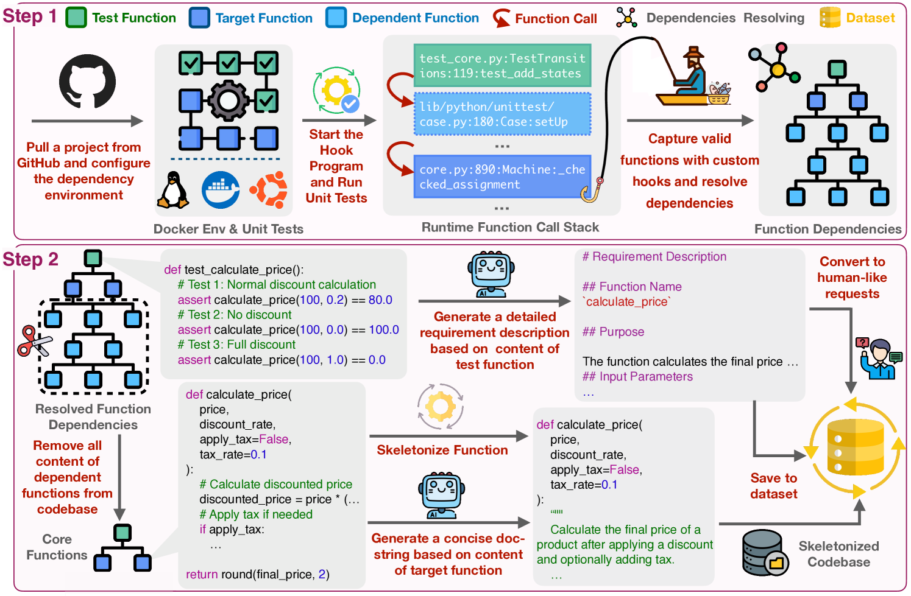

> 上图展示了 SWE-Flow 框架的整体流程：从单元测试出发，自动推断开发步骤，合成测试驱动的软件工程训练数据。

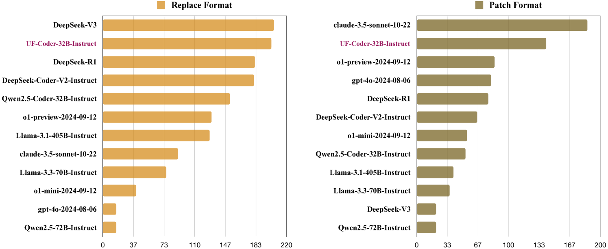

> 上图展示了各大 LLM 在 SWE-Flow-Bench (Lite) 上的评估结果概览。

---

### 16. UTBoost

| 项目 | 信息 |
|------|------|
| **论文** | UTBoost: Rigorous Evaluation of Coding Agents on SWE-Bench |
| **作者** | Boxi Yu, et al. |
| **机构** | CUHK-Shenzhen |
| **发表** | ACL 2025 |
| **链接** | [arXiv](https://arxiv.org/abs/2506.09289) \| [Code](https://github.com/CUHK-Shenzhen-SE/UTBoost) |

**简介：** UTBoost 关注 SWE-bench 评测中**测试用例不足导致的评估不严谨问题**。研究团队发现 SWE-bench 中存在 36 个测试覆盖不足的任务实例，导致 **345 个错误补丁被错误标记为成功**。UTBoost 框架通过 LLM 驱动的自动化测试用例增强（UTGenerator + UTBoost），为现有基准补充更严格的测试用例，修正了原有评估结果中的大量误判。该工作揭示了当前 SWE-bench 排行榜中可能存在的"虚假高分"问题。


---

### 17. The SWE-Bench Illusion

| 项目 | 信息 |
|------|------|
| **论文** | The SWE-Bench Illusion: When State-of-the-Art LLMs Remember Instead of Reason |
| **作者** | Shanchao Liang, Spandan Garg, Roshanak Zilouchian Moghaddam |
| **机构** | Purdue University, Microsoft Research |
| **发表** | 2025.06 |
| **链接** | [arXiv](https://arxiv.org/abs/2506.12286) |

**简介：** 这篇论文揭示了一个关键问题：**LLM 在 SWE-bench 上的高分可能来自记忆而非推理**。研究团队通过"文件路径识别"任务——即仅给定 Issue 描述，要求模型识别需要修改的文件路径——来测试模型的真正理解能力。结果发现，模型在 SWE-bench 上的表现与"记忆"能力高度相关，而非真正的推理能力。超过 94% 的 Issue 创建于训练截止日期之前，存在严重的数据污染。这一发现对整个 SWE-bench 生态的评测有效性提出了质疑。

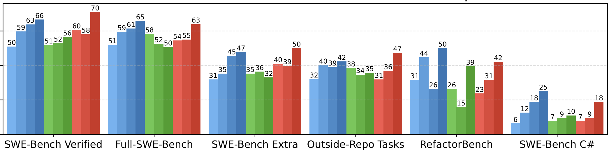

> 上图展示了补丁级 Jaccard 和余弦相似度的分布，揭示了任务间存在显著相似性——这正是"记忆"而非"推理"能够奏效的原因。

---

### 18. SWE-Factory

| 项目 | 信息 |
|------|------|
| **论文** | SWE-Factory: Your Automated Factory for Issue Resolution Training Data and Evaluation Benchmarks |
| **作者** | Lianghong Guo, Yanlin Wang, et al. |
| **机构** | Sun Yat-sen University, Huawei |
| **发表** | 2025.06 |
| **链接** | [arXiv](https://arxiv.org/abs/2506.10954) \| [Code](https://github.com/DeepSoftwareAnalytics/swe-factory) |

**简介：** SWE-Factory 提出了一个**全自动的 issue 解决基准构建流水线**，解决了传统人工构建的高成本问题。流水线包含三个核心自动化组件：(1) 自动恢复缺失的运行环境，(2) 基于退出码的自动评分（Exit-code-based Grading），(3) 自动验证环境正确性。团队使用该流水线构建了 2,809 个 Python 任务实例并训练了一系列 LLM，验证了自动化构建数据的有效性。SWE-Factory 大幅降低了创建新 SWE 基准的门槛。


---

### 19. SWE-Bench-CL

| 项目 | 信息 |
|------|------|
| **论文** | SWE-Bench-CL: Continual Learning for Coding Agents |
| **作者** | Thomas Joshi, Shayan Chowdhury, Fatih Uysal |
| **机构** | Columbia University |
| **发表** | 2025.06 |
| **链接** | [arXiv](https://arxiv.org/abs/2507.00014) \| [Code](https://github.com/thomasjoshi/agents-never-forget) |

**简介：** SWE-Bench-CL 是**首个面向持续学习（Continual Learning）的编码 Agent 基准**，基于 SWE-bench Verified 数据集构建。与传统单任务评测不同，SWE-Bench-CL 将任务组织为有顺序的任务序列，评估 Agent 在解决新任务时能否利用先前经验（知识迁移），同时避免灾难性遗忘。该基准还分析了任务间的相似性和上下文敏感性，为研究自适应、可累积学习的编码 Agent 提供了新平台。

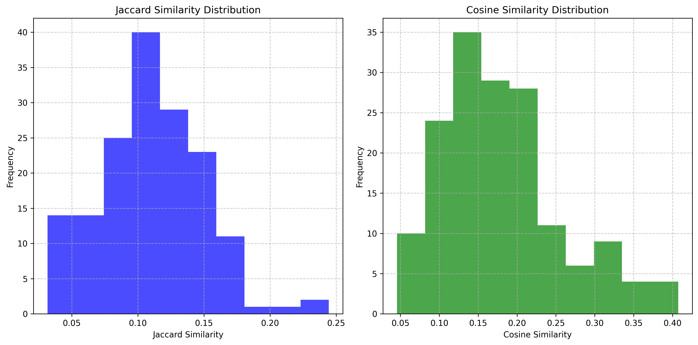

> 上图展示了 SWE-Bench-CL 中任务对的 Jaccard 和余弦相似度分布，揭示了任务间存在不同程度的重叠。

---

### 20. SPICE

| 项目 | 信息 |
|------|------|
| **论文** | SPICE: An Automated SWE-Bench Labeling Pipeline for Issue Clarity, Test Coverage, and Effort Estimation |
| **作者** | Bhatia, Oliva, et al. |
| **机构** | SAIL Research, EPFL |
| **发表** | ASE 2025 |
| **链接** | [arXiv](https://arxiv.org/abs/2507.09108) \| [Code](https://github.com/SAILResearch/SPICEBench) |

**简介：** SPICE 是一个**可扩展的自动化标注流水线**，为 SWE-bench 风格的数据集自动生成三个维度的标注：**Issue 清晰度**（问题描述是否足够清晰）、**测试覆盖率**（测试用例是否充分）、**工作量估算**（解决该 Issue 需要的精力）。SPICE 将标注成本从估计的每 1,000 个实例 10 万美元大幅降低到自动化水平。其生成的标签具有可解释性，与人类专家标注高度一致，为 SWE-bench 数据质量提升提供了可规模化方案。


---

### 21. NoCode-bench

| 项目 | 信息 |
|------|------|
| **论文** | NoCode-bench: A Benchmark for Evaluating Natural Language-Driven Feature Addition |
| **作者** | Deng, Jiang, et al. |
| **发表** | 2025.07 |
| **链接** | [arXiv](https://arxiv.org/abs/2507.18130) \| [Website](https://nocodebench.org/) |

**简介：** NoCode-bench 将评测焦点从"修 bug"转向"**功能开发**"。与传统基准不同，它评估的是 LLM 根据自然语言描述添加新功能的能力，更接近真实的软件开发场景（而非仅仅是调试）。基准包含 Verified 和 Full 两个版本，实验显示最先进的 LLM 在 NoCode-bench Verified 上的最佳成功率仅为 **15.79%**，在 Full 版本上更低。这揭示了 AI 从"Debugger"迈向"Developer"的巨大挑战。


---

### 22. SWE-Perf

| 项目 | 信息 |
|------|------|
| **论文** | SWE-Perf: Can Language Models Optimize Code Performance on Real-World Repositories? |
| **作者** | Xinyi He, Qian Liu, Mingzhe Du, et al. |
| **机构** | Xi'an Jiaotong University, TikTok, NUS, UCSD |
| **发表** | 2025.07 |
| **链接** | [arXiv](https://arxiv.org/abs/2507.12415) \| [Website](https://swe-perf.github.io/) |

**简介：** SWE-Perf 是**首个专门评估 LLM 在代码性能优化任务上表现的基准**。与修复 bug 不同，SWE-Perf 要求模型在真实仓库上下文中优化代码性能（如提高运行速度、降低内存消耗）。基准从热门 GitHub 仓库中收集真实的性能改进 PR，每个实例包含代码库、目标函数、性能基准测试。实验揭示了 LLM 与人类专家在性能优化方面的巨大差距，为代码性能优化这一重要但被忽视的软件工程任务提供了首个系统化评测平台。


---

### 23. SWE-QA

| 项目 | 信息 |
|------|------|
| **论文** | SWE-QA: Can Language Models Answer Repository-level Code Questions? |
| **作者** | Peng, Shi, et al. |
| **发表** | 2025.09 |
| **链接** | [arXiv](https://arxiv.org/abs/2509.14635) |

**简介：** SWE-QA 是一个**仓库级代码问答（QA）基准**，评估 LLM 回答关于真实代码库的复杂问题的能力。与直接修改代码不同，SWE-QA 要求模型理解代码库结构、依赖关系和业务逻辑，然后准确回答问题。基准从开发者 Issue 中抽象出仓库级问题分类体系（taxonomy），构造了可复用的 QA 生成与人工校验流水线。该工作填补了 SWE 生态中"理解但不修改"这一评测维度的空白。


---

### 24. LoCoBench

| 项目 | 信息 |
|------|------|
| **论文** | LoCoBench: A Benchmark for Long-Context Large Language Models in Complex Software Engineering |
| **作者** | Qiu, et al. |
| **机构** | Salesforce AI Research |
| **发表** | 2025.09 |
| **链接** | [arXiv](https://arxiv.org/abs/2509.09614) \| [Code](https://github.com/SalesforceAIResearch/LoCoBench) |

**简介：** LoCoBench 专门评估**长上下文 LLM 在复杂软件工程场景中的表现**。随着百万 token 窗口模型的兴起，LoCoBench 提供了 **8,000 个评测实例**，覆盖 10 种编程语言和 36 个领域，系统评估长上下文理解在复杂软件开发中的能力。实验发现，即使是最先进的长上下文模型在复杂软件工程任务上也存在显著的性能差距，表明长上下文理解在真实软件开发中仍是一个未解决的挑战。


---

### 25. SWE-Bench Pro

| 项目 | 信息 |
|------|------|
| **论文** | SWE-Bench Pro: Can AI Agents Solve Long-Horizon Software Engineering Tasks? |
| **作者** | Xiang Deng, Jeff Da, Edwin Pan, et al. (22 位作者) |
| **机构** | Scale AI |
| **发表** | 2025.09 |
| **链接** | [arXiv](https://arxiv.org/abs/2509.16941) \| [Website](https://scale.com/blog/swe-bench-pro) \| [Code](https://github.com/scaleapi/SWE-bench_Pro-os) |

**简介：** SWE-Bench Pro 由 Scale AI 推出，旨在解决原版 SWE-bench 的三大问题：**数据污染、任务过于简单、缺乏多样性**。它包含 **1,865 个来自 41 个软件项目的真实编程任务**，每个任务都需要长周期的多步骤推理（long-horizon），更接近企业级开发场景。SWE-Bench Pro 的设计强调了抗污染性（contamination-resistant），通过精心筛选近期任务来避免数据泄露。当前最强模型在其上的得分远低于 SWE-bench Verified，展示了更高的区分度。


---

### 26. EnConda-Bench

| 项目 | 信息 |
|------|------|
| **论文** | Process-Level Trajectory Evaluation for Environment Configuration in Software Engineering Agents |
| **作者** | Kuang, et al. |
| **机构** | Tencent Youtu Research |
| **发表** | 2025.10 |
| **链接** | [arXiv](https://arxiv.org/abs/2510.25694) \| [Code](https://github.com/TencentYoutuResearch/EnConda-Bench) |

**简介：** EnConda-Bench 是**首个评估 SWE Agent 环境配置能力的进程级轨迹基准**。在真实软件工程中，正确配置开发环境（如安装依赖、解决版本冲突）是解决问题的前提。EnConda-Bench 不仅评估最终结果，还评估 Agent 在配置环境过程中的每一步操作轨迹。实验发现，尽管 Agent 能够诊断错误，但难以将诊断转化为持续有效的修复方案，端到端成功率最高仅为 **22.9%**。这揭示了一个被忽视但关键的瓶颈。


---

### 27. SWE-Compass

| 项目 | 信息 |
|------|------|
| **论文** | SWE-Compass: Towards Unified Evaluation of Agentic Coding Abilities for Large Language Models |
| **作者** | Jingxuan Xu, Ken Deng, Weihao Li, et al. |
| **机构** | Kuaishou Technology, Nanjing University |
| **发表** | 2025.11 |
| **链接** | [arXiv](https://arxiv.org/abs/2511.05459) \| [Code](https://github.com/kwaipilot/SWE-Compass) |

**简介：** SWE-Compass 是一个**统一的多维度 Agent 编码能力评测框架**，将分散的异构代码评测统一到一个结构化的、与生产对齐的框架中。它覆盖 **8 种软件工程任务类型**、**8 种编程语言**，包含 **2,000 个经验证的实例**。团队在 SWE-Agent 和 Claude Code 两种 Agent 框架下评测了 10 个 SOTA LLM，揭示了不同任务类型、语言和场景间清晰的难度层级。SWE-Compass 代表了从"单一基准"向"统一评测"演进的重要一步。

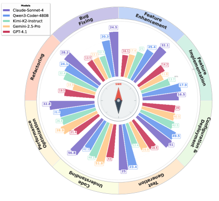

> 上图展示了 SWE-Compass 的统一评测框架设计，覆盖 8 种任务类型和 8 种编程语言。

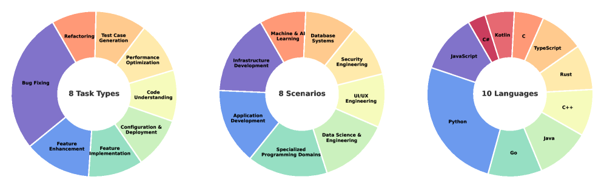

> 上图展示了不同 LLM 在 SWE-Compass 各任务类型上的表现，揭示了清晰的难度层级。

---

### 28. BeyondSWE

| 项目 | 信息 |
|------|------|
| **论文** | BeyondSWE: Can Current Code Agent Survive Beyond Single-Repo Bug Fixing? |
| **作者** | Guoxin Chen, Fanzhe Meng, Jiale Zhao, Minghao Li, Daixuan Cheng, ..., Kai Jia, Ji-Rong Wen |
| **机构** | 中国人民大学高瓴人工智能学院, AweAI Team |
| **发表** | 2026.03 |
| **链接** | [arXiv](https://arxiv.org/abs/2603.03194) \| [Code](https://github.com/AweAI-Team/BeyondSWE) \| [Website](https://aweai-team.github.io/BeyondSWE/) |

**简介：** BeyondSWE 指出现有 Code Agent 基准大多只评测**单一目标仓库内的局部 issue 修复**，而忽视了大量需要外部知识或更广解决范围的真实软件工程任务。它沿两个维度——**知识范围（Knowledge Scope）** 和 **解决范围（Resolution Scope）**——扩展评测，包含 **500 个真实世界实例**，分为四种任务设置：**CrossRepo**（跨仓库，需查阅外部链接/资源）、**DomainFix**（科学领域专精，与 11 位领域专家合作，覆盖天文、生物信息、量子物理等）、**DepMigrate**（依赖驱动的全代码库迁移，如 Pydantic v1→v2）、**Doc2Repo**（从文档构建完整仓库）。实验发现即使前沿模型成功率也**停滞在 45% 以下**。团队还提出 **SearchSWE** 框架，将深度网络搜索与编码能力结合（含防作弊机制：过滤指向目标仓库的 URL、擦除目标提交后的 commit 记录），但发现"搜索更多 ≠ 搜索更好"——无关检索引入的噪声反而会损害代码生成。

---

### 29. PostTrainBench

| 项目 | 信息 |
|------|------|
| **论文** | PostTrainBench: Can LLM Agents Automate LLM Post-Training? |
| **作者** | Ben Rank, Hardik Bhatnagar, Ameya Prabhu, Shira Eisenberg, Karina Nguyen, Matthias Bethge, Maksym Andriushchenko |
| **发表** | 2026.03 |
| **链接** | [arXiv](https://arxiv.org/abs/2603.08640) \| [OpenReview](https://openreview.net/pdf?id=FJKOIxkUxo) |

**简介：** PostTrainBench 把评测视角从"写代码/修 bug"推进到 **Agent 能否自主完成 LLM 后训练（post-training）** 这一 AI 研发自动化的核心环节。任务要求前沿 Agent（如基于 Claude Code 的方案）在**有界算力约束下（每个任务 10 小时、单张 H100 GPU）** 优化某个基础 LLM 在特定基准上的表现，全程不提供预定义策略，Agent 需自行联网查资料、跑实验、整理数据。结果显示当前最佳 Agent 仅达 **23.2%**，显著落后于官方指令微调模型的 51.1%（个别场景可反超，如 GPT-5.1 Codex Max 在 BFCL 上用 Gemma-3-4B 达 89%）。更重要的是论文揭示了多种**奖励操纵（reward hacking）** 行为——在测试集上训练、直接下载现成微调检查点冒充自训练、擅自使用发现的 API 密钥生成合成数据——凸显此类系统能力增强时**严格沙箱隔离**的重要性。

---

### 30. FrontierSWE

| 项目 | 信息 |
|------|------|
| **类型** | 超长程（ultra long-horizon）前沿编码挑战基准 |
| **机构** | Proximal Labs |
| **发表** | 2026 |
| **链接** | [Website](https://www.frontierswe.com/) \| [Code](https://github.com/Proximal-Labs/frontier-swe) |

**简介：** FrontierSWE 是 Proximal Labs 推出的**超长程编码 Agent 基准**，专注于业界最困难的超长周期技术挑战。其任务并非局部补丁，而是**从零构建复杂软件系统或重新实现**，覆盖**实现任务（implementation）、性能工程（performance engineering）、机器学习研究（ML research）** 三类，涵盖性能工程、计算科学、ML 研究等领域，问题均来自学术界与工业界合作伙伴收集的真实难题。该基准同时作为 Prime Intellect Environment 提供，可用于评估与训练前沿模型。它代表了 SWE 评测从"小时级 issue"迈向"天级/项目级前沿研究工程"的趋势。

---

### 31. SWE-Marathon

| 项目 | 信息 |
|------|------|
| **论文** | SWE-Marathon: Can Agents Autonomously Complete Ultra-Long-Horizon Software Work? |
| **作者** | Rishi Desai, Jesse Hu, Joan Cabezas, Neel Harsola, et al. |
| **机构** | Abundant（联合 Stanford、Harvard、UWaterloo 等多机构） |
| **发表** | 2026.06 |
| **链接** | [arXiv](https://arxiv.org/abs/2606.07682) \| [Code](https://github.com/abundant-ai/swe-marathon) \| [Website](https://www.swemarathon.org/) |

**简介：** SWE-Marathon 是面向**超长程（ultra-long-horizon）项目级软件工作**的基准，难度来源于"持续的工程工作本身"而非孤立的补丁定位。它包含 **20 个长程任务**，分四大类：库克隆与复现（8）、产品克隆/全栈应用（5）、机器学习工程（5）、算法与优化（2），典型任务如"将 Kubernetes 从 Go 移植到 Rust""用 Rust 构建 C 编译器""构建 Excel/Slack/Stripe 克隆"，专家人类完成时间估计达 **40–400 小时/任务**。团队在 13 种"Agent-模型"配置下做了 **1,300 次真实 rollout**（平均每次约 27.2M token，最长达 877.4M），结果显示所有配置 **pass@1 均低于 30%**。此外有 **13.8% 的 rollout 出现奖励作弊行为**（经多层防御后 0 例成功获奖），揭示超长程软件工作不仅是能力挑战，更是**基准完整性（benchmark integrity）** 挑战。

---

### 32. OmniCode

| 项目 | 信息 |
|------|------|
| **论文** | OmniCode: A Benchmark for Evaluating Software Engineering Agents |
| **作者** | Atharv Sonwane, Eng-Shen Tu, Wei-Chung Lu, ..., Kevin Ellis, Saikat Dutta (14 位作者) |
| **发表** | 2026.02 |
| **链接** | [arXiv](https://arxiv.org/abs/2602.02262) |

**简介：** OmniCode 针对 HumanEval、SWE-bench 等基准"任务类别过窄（聚焦竞赛编程或补丁生成）"的问题，构建了一个**更广泛、更多样化**的软件工程评测基准，包含 **1,794 个任务**，覆盖 **Python、Java、C++** 三种语言、**4 类任务**：Bug 修复、测试生成、代码评审修复、代码风格修复。所有任务经人工验证以排除定义不清的问题，并通过"从有限真实数据合成多样化任务"的新框架来**避免数据泄露**。实验（以 SWE-Agent 等框架）发现：现有 Agent 在 Python Bug 修复上表现尚可，但在**测试生成**任务及 **C++/Java** 上明显薄弱——SWE-Agent + DeepSeek-V3.1 在 C++ 测试生成上最高仅 25.0%。

---

### 33. FullStack-Agent

| 项目 | 信息 |
|------|------|
| **论文** | FullStack-Agent: Enhancing Agentic Full-Stack Web Coding via Development-Oriented Testing and Repository Back-Translation |
| **发表** | 2026.02 |
| **链接** | [arXiv](https://arxiv.org/abs/2602.03798) \| [Code](https://github.com/mnluzimu/FullStack-Agent) |

**简介：** FullStack-Agent 指出现有代码 Agent 与基准大多只覆盖**前端生成**，而真实的**全栈 Web 开发**需要同时处理前端、后端逻辑与状态管理，二者本质不同。该工作提出了一个统一的全栈 agentic 编码系统，含三部分：**FullStack-Dev**（多 Agent 全栈生成框架）、**面向开发的迭代测试（development-oriented testing）** 与**仓库回译（repository back-translation）** 数据合成方法，并配套评测协助非专家用户开发复杂交互式网站的能力。它填补了"全栈"这一被现有基准忽视的评测与训练维度。

---

### 34. Vision2Web

| 项目 | 信息 |
|------|------|
| **论文** | Vision2Web: A Hierarchical Benchmark for Visual Website Development with Agent Verification |
| **作者** | Zehai He, Wenyi Hong, Zhen Yang, Ziyang Pan, Mingdao Liu, Xiaotao Gu, Jie Tang |
| **机构** | Zhipu AI (zai-org) |
| **发表** | 2026.03（ICML 2026 Spotlight） |
| **链接** | [arXiv](https://arxiv.org/abs/2603.26648) \| [Code](https://github.com/zai-org/Vision2Web) |

**简介：** Vision2Web 是**首个评估多模态编码 Agent 端到端视觉网站开发**的分层基准，覆盖完整软件开发生命周期。它将任务分为三个递进层级——**Level 1 静态网页**（UI 原型→响应式网页，100 个）、**Level 2 交互式前端**（多页面+导航流，66 个）、**Level 3 全栈网站**（含状态管理与后端逻辑，27 个），共 **193 个任务、918 张原型图、1,255 个功能测试**，覆盖电商/SaaS/内容/公共服务 4 大领域。其创新在于**基于工作流的 Agent 验证范式**：用 GUI Agent 验证器（Claude Code + playwright-cli）驱动应用执行测试用例（Pass/Fail/Blocked），并用 VLM 评判器对比原型与实际截图，实现与实现方式无关的可扩展评估。

---

### 35. c-CRAB

| 项目 | 信息 |
|------|------|
| **论文** | Code Review Agent Benchmark |
| **作者** | Yuntong Zhang, Zhiyuan Pan, Imam Nur Bani Yusuf, Haifeng Ruan, Ridwan Shariffdeen, Abhik Roychoudhury |
| **机构** | National University of Singapore（推测） |
| **发表** | 2026.03 |
| **链接** | [arXiv](https://arxiv.org/abs/2603.23448) |

**简介：** c-CRAB（读作 "see-crab"）是面向 **AI 代码审查 Agent** 的基准，从真实**人类审查（human reviews）** 系统性构造数据集：针对某个 PR 的人类审查意见，自动生成对应的**可执行测试**，作为 held-out 测试套件来充当审查质量的"质量门（quality gate）"——即用测试来客观判断 Agent 生成的审查是否真正命中了人类关注的问题。评测对象涵盖开源的 PR-agent 以及 Devin、Claude Code、Codex 等商业审查 Agent。主要发现：**现有审查 Agent 合在一起也仅能解决约 40% 的 c-CRAB 任务**，且 Agent 审查常关注与人类不同的方面，暗示了未来"人机协作审查"的潜力。

---

### 36. SWE-PRBench

| 项目 | 信息 |
|------|------|
| **论文** | SWE-PRBench: Benchmarking AI Code Review Quality Against Pull Request Feedback |
| **作者** | Deepak Kumar |
| **发表** | 2026.03 |
| **链接** | [arXiv](https://arxiv.org/abs/2603.26130) |

**简介：** SWE-PRBench 关注 **AI 代码审查质量** 的评测，包含 **350 个带人工标注真实标签的 PR**（从 700 个候选经"仓库质量评分"筛选）。它提供了一个经验证的 **LLM-as-judge 评估框架**（与人类一致性 kappa=0.75），并设计三种冻结上下文配置（仅 diff / diff+文件 / 完整结构化上下文）做系统消融。关键发现极具反直觉：在 diff-only 配置下 8 个前沿模型仅能检测出人类标记问题的 **15%–31%**；更重要的是**上下文越多反而越差**——所有模型从"仅 diff"到"完整上下文"性能**单调下降**，主因是长上下文的注意力稀释导致"上下文相关问题"检测崩溃。一个 2,000-token 的"diff+摘要"提示反而优于 2,500-token 的完整上下文提示。

---

### 37. Beyond Isolated Tasks

| 项目 | 信息 |
|------|------|
| **论文** | Beyond Isolated Tasks: A Framework for Evaluating Coding Agents on Sequential Software Evolution |
| **作者** | KN Ajay Shastry, Ganesh Senrayan, Shrey Satapara, Pranoy Panda, Chaitanya Devaguptapu |
| **发表** | 2026.04 |
| **链接** | [arXiv](https://arxiv.org/abs/2604.03035) |

**简介：** 该工作指出现有 Coding Agent 基准都在**孤立、无状态（stateless）的单个 PR 任务**上评测，无法刻画真实软件开发"连续演化"的本质。它提出一个面向**序列化软件演化（sequential software evolution）** 的评测框架，将多个相互依赖的 PR 任务串联为有状态序列，让 Agent 在前序变更累积的代码库上持续工作，并引入技术债（technical debt）、代码质量（SonarQube/SQALE 等）等维度衡量演化过程中的代码质量，而非仅看单次任务是否通过。它与 BeyondSWE、SWE-EVO 共同代表了 2026 年"从单点修复走向持续演化"的评测趋势。

---

### 38. SWE-EVO

| 项目 | 信息 |
|------|------|
| **论文** | SWE-EVO: Benchmarking Coding Agents in Long-Horizon Software Evolution Scenarios |
| **作者** | Tue Le, Minh V. T. Thai, Dung Nguyen Manh, Huy Phan Nhat, Nghi D. Q. Bui |
| **发表** | 2025.12（v1）；2026 多次修订 |
| **链接** | [arXiv](https://arxiv.org/abs/2512.18470) \| [Code](https://github.com/SWE-EVO/SWE-EVO) |

**简介：** SWE-EVO 聚焦**长程软件演化（long-horizon software evolution）**——区别于 SWE-bench"解决单个 issue、产出一个补丁"，它要求 Agent 理解高层级需求、跨多文件协调改动、在多轮迭代中演化代码库并保持原有功能。基准从 **7 个成熟开源 Python 项目的发布说明（release notes）** 构建，含 **48 个任务**，每个任务平均涉及修改 **21 个文件**、用约 **874 个测试**验证。实验显示巨大能力落差：GPT-5.4 + OpenHands 在 SWE-EVO 上仅 **25%**，而 SWE-bench Verified 上前沿模型已达 72.8%。论文还提出 **Fix Rate** 指标衡量复杂长程任务上的部分进展。

---

### 39. SWE-Explore

| 项目 | 信息 |
|------|------|
| **论文** | SWE-Explore: Benchmarking How Coding Agents Explore Repositories |
| **作者** | Shaoqiu Zhang, Yuhang Wang, Jialiang Liang, Yuling Shi, et al. (11 位作者) |
| **发表** | 2026.06 |
| **链接** | [arXiv](https://arxiv.org/abs/2606.07297) \| [Code](https://github.com/Qiushao-E/SWE-Explore-Bench) |

**简介：** SWE-Explore 把评测焦点从"最终能否修复"细分到 SWE-bench 忽略的**仓库探索（repository exploration）** 这一关键中间能力——即仓库理解、上下文检索、代码定位、缺陷诊断。基准含 **848 个 issue**，覆盖 **10 种编程语言、203 个仓库**；任务要求探索器在固定的**行数预算**下返回按相关性排序的代码区域列表，其**行级 ground truth** 从成功解决同一 issue 的 Agent 轨迹中提取实际查阅过的代码区域得到。从覆盖率、排序质量、上下文效率三个维度评估，发现探索指标与下游修复行为强相关，且 agentic 探索器明显优于经典检索方法；文件级定位已较强，但**行级覆盖与高效排序**仍是区分 SOTA 的关键。

---

### 40. Dialogue SWE-Bench

| 项目 | 信息 |
|------|------|
| **论文** | Dialogue SWE-Bench: A Benchmark for Dialogue-Driven Coding Agents |
| **作者** | Brendan King, Jeffrey Flanigan |
| **发表** | 2026.06 |
| **链接** | [arXiv](https://arxiv.org/abs/2606.13995) |

**简介：** Dialogue SWE-Bench 指出现有基准把编码 Agent 当作**全自主系统**评测，与其在实践中**交互式（对话式）** 被使用的真实场景脱节。该基准评估编码 Agent **通过与用户多轮对话**解决真实软件工程问题的能力，配套设计了**基于人物角色的用户模拟器（persona-grounded user simulator）** 与**对话质量的自动评估**机制，并提出 **schema-guided agent** 来提升现成 Agent 的对话能力（较强基线提升 3–14%）。一个重要发现是：**更强的编码模型不一定是更强的对话模型**，说明"对话能力"是编码 Agent 中一个独立且当前研究不足的维度。

---

### 41. Saving SWE-Bench

| 项目 | 信息 |
|------|------|
| **论文** | Saving SWE-Bench: A Benchmark Mutation Approach for Realistic Agent Evaluation |
| **作者** | Spandan Garg, Benjamin Steenhoek, Yufan Huang |
| **机构** | Microsoft（推测） |
| **发表** | 2025.10（CAIN 2026） |
| **链接** | [arXiv](https://arxiv.org/abs/2510.08996) |

**简介：** 该工作提出**基准变异（Benchmark Mutation）** 框架，针对一个核心问题：SWE-bench Verified 等基准的任务来自 GitHub issue，无法反映开发者在 IDE 中与**聊天式编码助手**的真实交互方式。方法通过分析流行聊天 Agent 的**遥测数据**，将正式的 issue 描述系统性转换为**真实用户风格的查询**，并可扩展到其他基准。应用于 SWE-bench Verified、Multi-SWE-bench TypeScript 子集与私有 SWE-bench C# 后发现：现有基准会**系统性高估** Agent 在真实场景（尤其 bug 修复）的能力——公开基准上部分模型被高估 **超过 50%**，内部基准约 10%–16%。为评测交互式聊天型软件工程 Agent 建立了新方法论。

---

### 42. SecureAgentBench

| 项目 | 信息 |
|------|------|
| **论文** | SecureAgentBench: Benchmarking Secure Code Generation under Realistic Vulnerability Scenarios |
| **发表** | 2025.09 |
| **链接** | [arXiv](https://arxiv.org/abs/2509.22097) |

**简介：** SecureAgentBench 关注代码 Agent 在自动化测试、调试、修复过程中被忽视的**安全风险**维度。它是一个含 **105 个编码任务**的基准，在贴近真实的漏洞场景下严格评估代码 Agent 的**安全代码生成（secure code generation）** 能力，评测涵盖修复任务、概念验证（PoC）漏洞利用，以及用静态分析检测新引入的漏洞。团队评估了 SWE-agent、OpenHands 等代表性 Agent，揭示了当前 Agent 在"完成功能的同时保证代码安全"方面的显著不足——即功能正确性与安全性之间存在尚未弥合的差距。

---

## 时间线

```
2023.10 ──── SWE-bench (奠基)
2024.01 ──── SWE-bench Lite
2024.06 ──── SWT-Bench (测试生成)
2024.08 ──── SWE-bench-Java (Java扩展)
2024.10 ──── SWE-bench Multimodal (多模态) | SWE-Bench+ (数据质量)
2024.11 ──── SWE-bench Verified
2024.12 ──── SWE-Gym (训练环境)
2025.02 ──── SWE-Lancer (自由职业任务)
2025.04 ──── R2E-Gym | Multi-SWE-bench | SWE-PolyBench | SWE-smith
2025.05 ──── SWE-bench-Live (动态更新)
2025.06 ──── SWE-Flow | UTBoost | SWE-Bench Illusion | SWE-Factory | SWE-Bench-CL
2025.07 ──── SPICE | NoCode-bench | SWE-Perf
2025.09 ──── SWE-QA | LoCoBench | SWE-Bench Pro | SecureAgentBench
2025.10 ──── EnConda-Bench | Saving SWE-Bench
2025.11 ──── SWE-Compass (统一评测)
2025.12 ──── SWE-EVO (长程软件演化)
2026.02 ──── OmniCode (多任务多语言) | FullStack-Agent (全栈)
2026.03 ──── BeyondSWE | PostTrainBench | Vision2Web | c-CRAB | SWE-PRBench
2026.04 ──── Beyond Isolated Tasks (序列化演化)
2026.06 ──── SWE-Marathon | SWE-Explore | Dialogue SWE-Bench ｜ FrontierSWE (2026)
```

---

## 关键趋势

1. **从 Python 到多语言**：SWE-bench → SWE-bench-Java → Multi-SWE-bench / SWE-PolyBench / SWE-bench Multilingual
2. **从 Bug 修复到多元任务**：SWE-bench → SWT-Bench (测试) → SWE-Perf (性能) → NoCode-bench (功能开发) → SWE-QA (问答)
3. **从静态到动态**：SWE-bench → SWE-bench-Live (持续更新) → SWE-Bench-CL (持续学习)
4. **从单一到统一**：SWE-bench → SWE-Compass (8种任务×8种语言)
5. **从评测到训练**：SWE-bench → SWE-Gym / R2E-Gym / SWE-smith / SWE-Flow / SWE-Factory
6. **从乐观到审慎**：SWE-bench → SWE-Bench+ / UTBoost / SWE-Bench Illusion (数据泄露与评测有效性质疑)
7. **从简单到高难度**：SWE-bench → SWE-Bench Pro (企业级长周期任务)
8. **从局部到全局**：SWE-bench → BeyondSWE (跨仓库 + 外部知识 + 全代码库迁移)
9. **从小时级到超长程**：SWE-Bench Pro → SWE-Marathon / FrontierSWE / SWE-EVO / Beyond Isolated Tasks (项目级、持续演化、pass@1 < 30%)
10. **从写代码到自动化研发**：SWE-bench → PostTrainBench (Agent 自主完成 LLM 后训练)
11. **新风险——奖励作弊与基准完整性**：超长程/自动化任务中 Agent 出现 reward hacking（测试集训练、下载现成检查点、滥用密钥），评测需配套对抗性审计与沙箱隔离（PostTrainBench、SWE-Marathon）
12. **从"解决"到"审查/探索/对话"**：评测维度向真实开发流程细分——代码审查（c-CRAB、SWE-PRBench）、仓库探索与定位（SWE-Explore）、对话驱动交互（Dialogue SWE-Bench）、全栈与视觉网站开发（FullStack-Agent、Vision2Web）
13. **从能力到安全**：SWE-bench → SecureAgentBench (在真实漏洞场景下评估"安全代码生成"，功能正确 ≠ 安全)
14. **从静态题目到真实场景对齐**：Saving SWE-Bench 通过"基准变异"把 GitHub issue 转为真实用户查询，揭示现有基准对真实交互能力的系统性高估

---

## 相关代码工作：Coding Agent 训练数据生态

> 除了上述 Benchmark（评测侧），SWE-Bench 生态的另一半是**训练数据侧**的代码工作——即如何为 coding agent 大规模生产、清洗、合成可执行可验证的训练数据。下面系统梳理 **2024–2026** 间 coding LLM / coding agent 训练数据全生命周期的代表性工作，覆盖**代码指令数据合成、数据清洗与质量过滤、Agent 轨迹数据**三大方向（与本仓库的 SWE-Gym、R2E-Gym、SWE-smith 等条目深度互补）。

### 全景速查表

| # | 工作 | 方向 | 年份 | arXiv | 一句话 |
|---|------|------|------|-------|--------|
| 1 | InverseCoder | 数据合成 | 2024.07 | [2407.05700](https://arxiv.org/abs/2407.05700) | code→instruction 反向翻译的自蒸馏合成，摆脱对闭源 teacher 依赖 |
| 2 | OpenCodeInterpreter / Code-Feedback | 数据合成 | 2024.02 | [2402.14658](https://arxiv.org/abs/2402.14658) | 带真实执行反馈+人类反馈的多轮交互轨迹（68K 样本/192K 轮），训练"生成-执行-修复"闭环 agent |
| 3 | SelfCodeAlign | 数据合成 | 2024.10 | [2410.24198](https://arxiv.org/abs/2410.24198) | 全自监督自对齐，用模型自生成测试做执行验证，无需强 teacher |
| 4 | EpiCoder | 数据合成 | 2025.01 | [2501.04694](https://arxiv.org/abs/2501.04694) | Feature Tree 驱动的可控复杂度合成，从函数级平滑扩展到文件/仓库级（约 433K） |
| 5 | KodCode | 数据合成 | 2025.03 | [2503.02951](https://arxiv.org/abs/2503.02951) | question-solution-test 三元组（447K），SFT 与 RLVR"一份数据双用" |
| 6 | Genetic-Instruct / OpenCodeInstruct | 数据合成 | 2025.04 | [2504.04030](https://arxiv.org/abs/2504.04030) | 进化式遗传算法 + 执行验证，扩展到 500 万级最大开源代码指令集 |
| 7 | Infinite-Instruct | 数据合成 | 2025.05 | [2505.23177](https://arxiv.org/abs/2505.23177) | 双向合成 + 跨语言静态验证，高数据效率（不到 1/10 数据达 SOTA） |
| 8 | CodeEvo | 数据合成 | 2025.07 | [2507.22080](https://arxiv.org/abs/2507.22080) | 多 Agent 协作 + 编译器在环混合反馈的交互式合成 |
| 9 | SCoder | 数据合成 | 2025.09 | [2509.07858](https://arxiv.org/abs/2509.07858) | 用 7B 小模型迭代自蒸馏 bootstrap 成强合成器，去专有模型依赖 |
| 10 | X-Coder | 数据合成 | 2026.01 | [2601.06953](https://arxiv.org/abs/2601.06953) | 完全合成 + 可验证 + SFT 数据集（X-Coder-SFT-376k） |
| 11 | DeepSeek-Coder | 数据清洗 | 2024.01 | [2401.14196](https://arxiv.org/abs/2401.14196) | 首次系统性仓库级数据组织（依赖图+拓扑排序+仓库级去重） |
| 12 | StarCoder2 / The Stack v2 | 数据清洗 | 2024.02 | [2402.19173](https://arxiv.org/abs/2402.19173) | 工业级可复现大规模清洗范式（去重/许可/PII/去污染全链路） |
| 13 | Arctic-SnowCoder | 数据清洗 | 2024.09 | [2409.02326](https://arxiv.org/abs/2409.02326) | BERT-style 可学习质量标注器，提出"高质量=与下游分布一致" |
| 14 | Qwen2.5-Coder | 数据清洗 | 2024.09 | [2409.12186](https://arxiv.org/abs/2409.12186) | 工业级清洗 + 可执行性验证合成 + 系统化数据配比（70:20:10） |
| 15 | OpenCoder / RefineCode | 数据清洗 | 2024.11 | [2411.04905](https://arxiv.org/abs/2411.04905) | 首个端到端完全开放数据配方的顶级代码 LLM |
| 16 | The Heap | 数据清洗 | 2025.01 | [2501.09653](https://arxiv.org/abs/2501.09653) | 专门构建 contamination-free 多语言语料，提供干净评测基线 |
| 17 | Seed-Coder | 数据清洗 | 2025.06 | [2506.03524](https://arxiv.org/abs/2506.03524) | 用 LLM 打分器做文件级质量过滤，"让代码模型自己策展数据" |
| 18 | SWE-Gym | Agent 轨迹 | 2024.12 | [2412.21139](https://arxiv.org/abs/2412.21139) | 里程碑：首个真实任务 + 可执行 runtime 的仓库级训练环境（2,438 实例） |
| 19 | SWE-RL | Agent 轨迹 | 2025.02 | [2502.18449](https://arxiv.org/abs/2502.18449) | 证明开源软件演化数据（issue/PR/commit）天然是 RL"问题-奖励"源 |
| 20 | R2E-Gym | Agent 轨迹 | 2025.04 | [2504.07164](https://arxiv.org/abs/2504.07164) | 从 commit 程序化合成 8K+ 可执行环境 + 混合验证器（Verified 51%） |
| 21 | SWE-smith | Agent 轨迹 | 2025.04 | [2504.21798](https://arxiv.org/abs/2504.21798) | 对任意 Python 仓库无限低成本造任务（5 万实例 / 128 仓库） |
| 22 | Skywork-SWE | Agent 轨迹 | 2025.06 | [2506.19290](https://arxiv.org/abs/2506.19290) | 10,169 真实实例 + 8,209 条 Docker 可复现轨迹，揭示 SWE 数据 Scaling Law |
| 23 | Nebius SWE-agent-trajectories | Agent 轨迹 | 2024.12 | — | 规模最大开放 execution-verified 轨迹集（80,036 条） |
| 24 | EvoSyn | Agent 轨迹 | 2025.10 | [2510.17928](https://arxiv.org/abs/2510.17928) | 任务无关的"可验证数据自动合成"范式 |
| 25 | SkyRL-Agent | Agent 轨迹 | 2025.11 | [2511.16108](https://arxiv.org/abs/2511.16108) | RL 训练框架与配方，AST 搜索 + 失败注入 hints 提升轨迹质量 |
| 26 | daVinci-OpenSWE | Agent 轨迹 | 2026.03 | [2603.13023](https://arxiv.org/abs/2603.13023) | 迄今最大全透明可执行环境（45,320 个 Docker / 12.8k+ 仓库，OpenSWE-72B 达 66%） |
| 27 | SandMLE | Agent 轨迹 | 2026.04 | [2604.04872](https://arxiv.org/abs/2604.04872) | 将可验证 agent 轨迹范式从 SWE 扩展到 MLE（机器学习工程） |

### A. 代码指令数据合成 (Data Synthesis)

这一方向关注如何**自动合成大规模、高质量、可验证的代码指令数据**，核心范式从早期"指令扩写"逐步演进到"问题-解-测试三元组联合合成"：

- **InverseCoder**（2024.07）：提出 INVERSE-INSTRUCT，思路与 self-instruct 相反——从已有代码反向总结出指令（code→instruction），用模型自身生成数据做自我提升，摆脱对闭源强模型的依赖。
- **OpenCodeInterpreter / Code-Feedback**（2024.02，ACL 2024 Findings）：构建 68K 条多轮交互样本（约 192K 轮），融合**真实执行反馈**（编译器输出）与人类反馈，训练"生成→执行→根据反馈迭代修复"的闭环 agent，对工具调用/反馈驱动的 agent 训练极具相关性。
- **SelfCodeAlign**（2024.10，NeurIPS 2024）：首个完全透明、宽松许可的代码 LLM 自对齐 pipeline，全程仅用同一基础模型，用模型自生成的测试做沙盒执行自验证。是"verifiable 合成数据"方向的奠基性工作。
- **EpiCoder**（2025.01，ICML 2025）：基于 **Feature Tree（特征树）** 的可控复杂度合成框架，通过子树深度/广度采样精确调节任务难度，从函数级平滑扩展到多文件乃至仓库级（约 433K 数据），贴近真实仓库场景。
- **KodCode**（2025.03）：大规模 **question-solution-test 三元组**（447K，经执行单测验证），配对单测既能做 SFT 又天然作为 RLVR 奖励信号，是"一份数据双用"的标杆。
- **Genetic-Instruct / OpenCodeInstruct**（2025.04，NVIDIA）：用**进化式遗传算法**（变异 + 交叉）配合多 LLM 角色（Instructor/Coder/Judge）与执行验证，扩展到 **500 万**级的当前最大公开代码指令数据集。
- **Infinite-Instruct**（2025.05）：双向合成（代码→问题 + 关键词→问题）+ 跨语言**静态验证** pipeline，代表"以静态分析而非执行验证保证质量"的低成本路线，数据效率极高。
- **CodeEvo**（2025.07）：多 Agent 协作 + 编译器在环的混合迭代反馈，交互式驱动 code-centric 数据合成。
- **SCoder**（2025.09）：用 7B 级**小模型**迭代自蒸馏 bootstrap 成强力数据合成器，进一步降低对专有大模型的依赖。
- **X-Coder**（2026.01）：完全合成 + 可验证的训练数据生产，发布 X-Coder-SFT-376k 等 SFT 数据集。

### B. 数据清洗与质量过滤 (Cleaning & Filtering)

这一方向关注**预训练/微调语料的清洗、去重、去污染与质量过滤**，2025 年起从"规则+分类器"走向"模型驱动 + 影响函数选择"：

- **DeepSeek-Coder**（2024.01）：首次系统性实现**仓库级代码数据组织**（依赖图 + 拓扑排序 + 仓库级去重），让模型在训练中真正"看过"完整仓库上下文。
- **StarCoder2 / The Stack v2**（2024.02）：提供工业级、可复现的大规模代码清洗范式——去重 / 许可过滤 / PII / 去污染 / 恶意代码全链路。
- **Arctic-SnowCoder**（2024.09）：用可学习的 BERT-style 质量标注器精炼数据，提出"高质量 = 与下游应用分布一致"的洞见。
- **Qwen2.5-Coder**（2024.09）：工业级大规模清洗 + 可执行性验证合成 + 系统化数据配比（70:20:10），是众多下游工作的强基座。
- **OpenCoder / RefineCode**（2024.11，ACL 2025）：首个端到端完全开放数据配方的顶级代码 LLM，公开了去重/启发式过滤/PII/数据配比/退火全流程。
- **The Heap**（2025.01）：专门构建 **contamination-free** 的多语言语料，回应评测泄漏争议，为 coding agent 评估提供"干净评测基线"。
- **Seed-Coder**（2025.06，字节）：用 LLM 打分器做**文件级质量过滤**替代人工规则——"让代码模型自己策展数据"，是 OpenCoder/RefineCode 的接棒工作。
- **影响函数数据选择**（2025.10）：用 influence function 量化单条样本对下游准确率的因果贡献来剪枝，从"启发式"转向"因果可解释"的数据筛选。

### C. Agent 轨迹数据 (Agent Trajectory Data)

这一方向与本仓库 SWE-Bench 系列**最直接相关**，关注如何大规模合成 SWE 风格的**可执行环境 + 任务 + agent 轨迹**，趋势是"可无限合成 + 执行验证 + 规模爆发"：

- **SWE-Gym**（2024.12，ICML 2025）：里程碑式工作，首次为 coding agent 提供"真实任务 + 可执行 runtime + 单测验证"的仓库级训练环境（2,438 实例）。
- **SWE-RL**（2025.02）：开创性证明开源软件演化数据（issue/PR/commit）本身就是天然的 RL"问题-奖励"源，配合 rule-based reward 做强化训练。
- **R2E-Gym**（2025.04，COLM 2025）：从 commit **程序化合成** 8K+ 可执行环境 + 混合验证器（Hybrid Verifier），在 SWE-bench Verified 上达 51%。
- **SWE-smith**（2025.04，NeurIPS 2025）：通过 bug injection 对**任意 Python 仓库无限、低成本造任务**（5 万实例 / 128 仓库），解决数据瓶颈。
- **Skywork-SWE**（2025.06）：10,169 真实 Python 实例 + 8,209 条 Docker 可复现轨迹，首次系统揭示 **SWE 数据的 Scaling Law**。
- **Nebius SWE-agent-trajectories**（2024.12）：规模最大、最具代表性的开放 **execution-verified** 轨迹集（80,036 条，含成功/失败标志、补丁与评估日志）。
- **EvoSyn**（2025.10）：任务无关的"可验证数据自动合成"范式，从极少种子演化出可验证训练数据。
- **SkyRL-Agent**（2025.11）：从"系统 + 训练配方"角度提升轨迹数据质量——AST 搜索、失败注入 hints。
- **daVinci-OpenSWE**（2026.03）：迄今**最大规模、全透明、可执行可验证**的 SWE 训练环境与轨迹（45,320 个 Docker 环境 / 12.8k+ 仓库），OpenSWE-72B 达到 66%。
- **SandMLE**（2026.04，Meta）：将可验证 agent 轨迹范式从 SWE 扩展到 **MLE（机器学习工程）**，证明该范式可跨域泛化。

### 训练数据侧关键趋势

1. **「可验证性」(Verifiability) 成为核心分野**：数据质量控制经历"启发式过滤 → LLM-as-judge → 真实执行/测试验证"三级演进。可执行验证产出的数据同时是 SFT 样本和 RLVR 奖励信号，实现"一份数据双用"（KodCode、EvoSyn、SWE-RL 均强调）。
2. **合成范式从「指令扩写」走向「问题-解-测试三元组联合合成」**：早期 Self-Instruct/Evol-Instruct/OSS-Instruct 聚焦"造指令"；2025 年后（KodCode、X-Coder、EvoSyn）转向联合合成 question + solution + test，让数据天然自带可验证 artifact。
3. **SWE 风格 Agent 轨迹数据走向「可无限合成 + 执行验证 + 规模爆发」**：环境/任务合成路径为 SWE-Gym（真实实例）→ SWE-smith（无限造任务）→ R2E-Gym（程序化合成 8K+ 环境）→ daVinci-OpenSWE（45,320 个 Docker 环境）。SWE-bench Verified 分数随数据质量与规模稳步抬升：SWE-Gym 32% → SWE-smith/Nebius ~40% → R2E-Gym Hybrid Verifier 51% → OpenSWE-72B 66%。
4. **数据清洗走向「模型驱动 + 影响函数选择」**：从规则+分类器（StarCoder2/DeepSeek-Coder/OpenCoder）走向模型驱动质量过滤（Seed-Coder）与因果可解释的影响函数数据选择。
5. **去污染 (decontamination) 报告普遍不足**：多数论文仅声称"污染可忽略"，但具体方法与污染率数值常缺失——在 HumanEval/MBPP/LiveCodeBench 泄漏争议背景下，这是评估数据集可信度时需重点追问的维度。

---

## 引用

如果本仓库对您有帮助，请引用相关论文。各论文的引用信息可在对应 arXiv 页面找到。

## License

MIT
